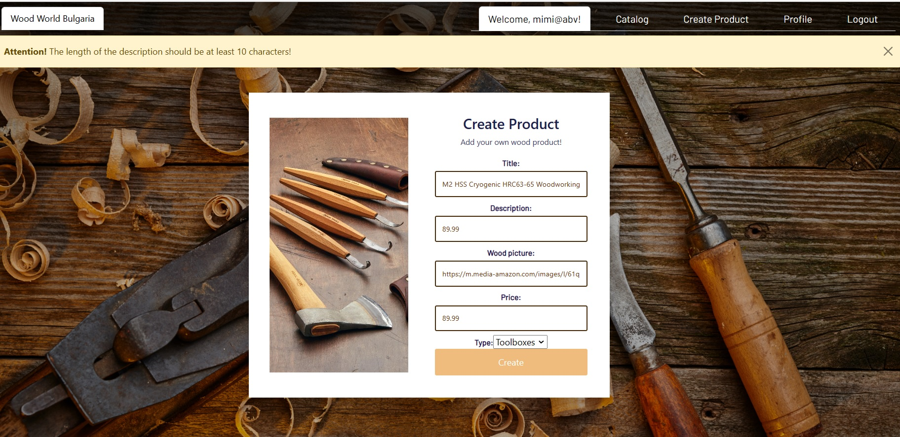
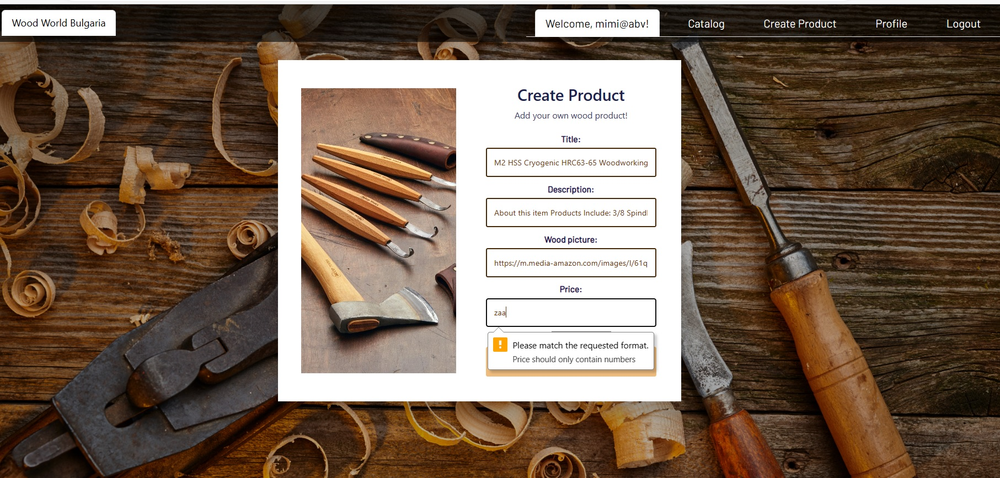

# My-React-Prodject-2023

#  Wood Woord Bulgaria

"Wood Woord Bulgaria" is a place, where you can browse some of the most popular Wood working product,tools, furnitures and other product in the world and add some new product that you have created. Authenticated users can like and comment on products in the app. Sellers can use the platform to add, update and delete products from their profile page.

The  "Wood Woord Bulgaria"  application contains the following views: login page, registration page, logout page, personal profile page, catalog page and details page.

The front end of the project has been deploy in Firebase:  https://react-wood-working.web.app

## Short description
 - This project was bootstrapped with [Create React App](https://github.com/facebook/create-react-app).
 - Single Page App (SPA) - React.js.Single Page App (SPA) - React.js.
 
 ## Usage
- `server` cd server `node server.js`
- `client` cd client  `npm start`
- email - peter@abv.bg
- password - 123456
 
## Languages and libraries used
 - React.js
 - Javascript
 - HTML/CSS
 - Bootstrap
 
 ## Architecture - the project is structured
 - `client` folder contains the whole project.
 - `public` folder contains global asssets for the app(including the json file for simulating Web API calls).
 - `src` folder contains the App.js, index.js and folders for the components, contexts, reducers, contexts hooks and service.
 - `components` folder - properly named folder for each component that includes the component itself, the css  for the component).
 - `reducers` folder - contains custom reducer
 - `hooks` folder - contains custom hooks
 - `contexts` folder -  contains custom contexts
 - `services` folder - contains unified requester and service (for each resource) for handling AJAX requests.
contexts folder.
 
# Routes views

## Home Page

## Register Page

## Login Page 

## Profile Page

## Catalog Guest Page

## Catalog Profile Page

## Create  Page and Validation

## Edit Page

## Delete Product

## Owner Details Page

## Details Comment Page.jpg

## Details Page Comment

## Details Page Add Comment

## Details Page Like Product

## PageNotFound

